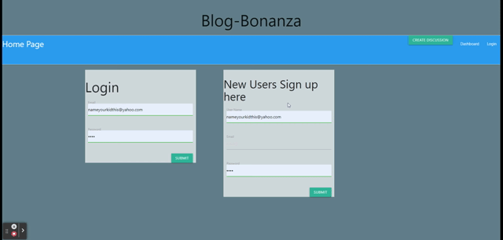

  
# Blog-Bonanza

## Description
This project was built for creating a online discussion about technology in a blog style format.  Users may create an account, create discussions, and add comments to previous discussions. Simply open the heroku app in your browser and create an account to post or comment.  My motivation for this project was to create a way for users to interact with each other and store their comments, posts, and user information in a database.  It is important that we advocate for community among internet users!.
I wanted to help the user communicate with other members in the community on topics of interest.  It also is a full-stack web app and is my first application that has a login feature!.  I learned the Model View Controller type architecture, how to create sessions/cookies, and how to use handlebars as a front-end framework.  I also learned to importance of consistency and why pseudo-code plays an important role in creating names of variables, routes, and models.  Many mistakes were made in how objects and methods were named, and much time was spent adding the Comment functionality into the mix of the BlogPost and User models.. 

# Table of Contents
- [Installation](#Installation)
- [Description](#Description)
- [Usage](#Usage)
- [What-I-learned](#What-I-Learned)
- [Tests](#Tests)
- [Screenshot-of-Application](#Screenshot-of-Application)
- [Links](#Links)
- [Questions?](#Questions?)
- [License](#License)

## Installation
In order to install this project you will need to simply run this application from your browser!  If you would like to clone the repository, make sure to npm i to install the dependencies, and correctly link your mySQL .env file with correct username and password.

## Usage
This Project is used for creating a online discussion about technology in a blog style format.  Users may create an account, create discussions, and add comments to previous discussions.. *elaborate on your project motivation and use here*

## What-I-Learned
I learned the Model View Controller type architecture, how to create sessions/cookies, and how to use handlebars as a front end framework.  I also learned to importance of consistency and why pseudo code plays an important role in creating names of variables, routes, and models.  Many mistakes were made in how objects and methods were named, and much time was spent adding the Comment functionality into the mix of the BlogPost and User models.
Email me if there were issues in this project.  The following route was the last to implement to get the User's name to populate in the `dashboard.handlebars` file.

    router.get('/topic/:id', withAuth, async (req, res) => {
      if (!req.session.logged_in) {
          res.redirect('/login');
          return;
      }
      try {
          const blogData = await BlogPost.findByPk(req.params.id, {
              include: [
                  User,
                  {
                  model: Comment,
                      include: [
                          User
                      ]
                  },
              ],
          });

## Tests
There are no current tests for this application

## Screenshot of Application

## Links
[Heroku deployment](https://blog-bonanza.herokuapp.com/)

## Questions?
My gitHub user name is byrdbass, and you may email me at byrdbass@gmail.com for Questions.
You may contribute to this project by please emailing me with feedback!.

## License
MIT
